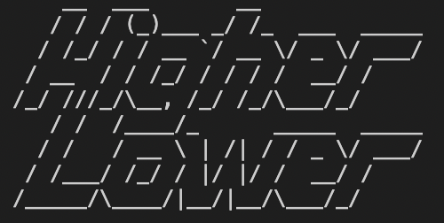
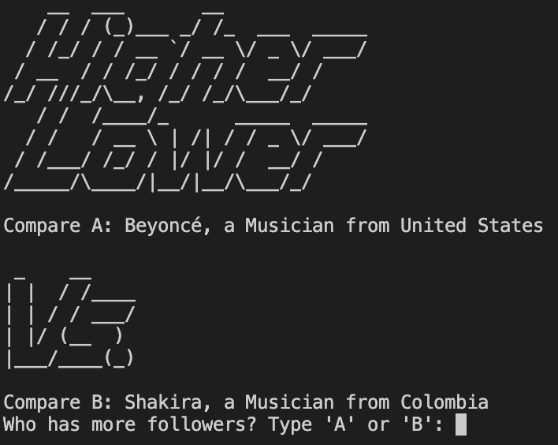
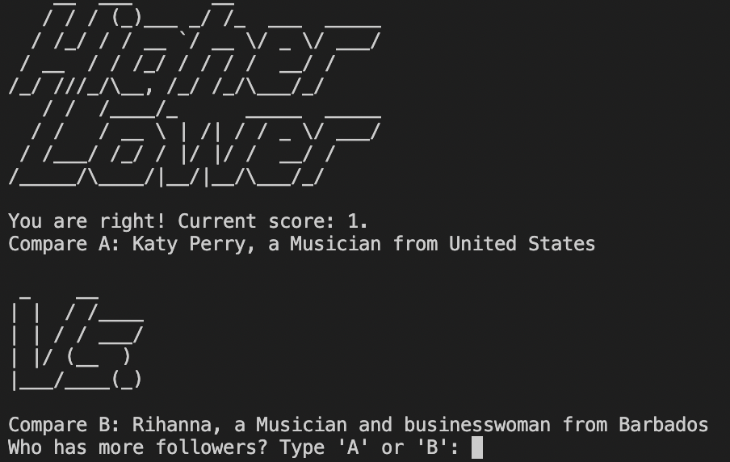
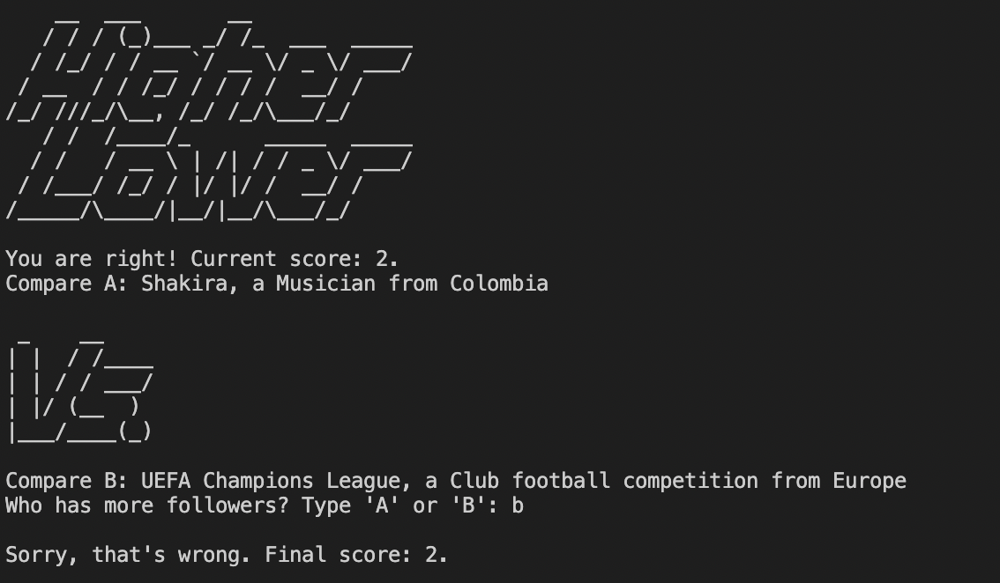

<div id="top"></div>
<!--
*** Thanks for checking out the Best-README-Template. If you have a suggestion
*** that would make this better, please fork the repo and create a pull request
*** or simply open an issue with the tag "enhancement".
*** Don't forget to give the project a star!
*** Thanks again! Now go create something AMAZING! :D
-->

<!-- PROJECT SHIELDS -->
<!--
*** I'm using markdown "reference style" links for readability.
*** Reference links are enclosed in brackets [ ] instead of parentheses ( ).
*** See the bottom of this document for the declaration of the reference variables
*** for contributors-url, forks-url, etc. This is an optional, concise syntax you may use.
*** https://www.markdownguide.org/basic-syntax/#reference-style-links
-->
<!-- [![Contributors][contributors-shield]][contributors-url]
[![Forks][forks-shield]][forks-url]
[![Stargazers][stars-shield]][stars-url]
[![Issues][issues-shield]][issues-url]
[![MIT License][license-shield]][license-url]
[![LinkedIn][linkedin-shield]][linkedin-url] -->

<!-- PROJECT LOGO -->
<br />
<div align="center">
  <a href="https://github.com/sanduler/higher-lower-py">
    
  </a>

<h3 align="center">Caesar Cipher</h3>

  <p align="Higher Lower Game">
    In the higher lower game the user puts themselfs to the test to see if they know who are the most popular influencers on Instagram. Simply decide which Person has the most follower count searched for the most by selecting higher or lower. The objective is to get the most right guesses in a row and not break the streak.
    <br />
    <a href="https://github.com/sanduler/higher-lower-py"><strong>Explore the docs »</strong></a>
    <br />
    <br />
    <a href="https://github.com/sanduler/higher-lower-py">View Demo</a>
  </p>
</div>

<!-- TABLE OF CONTENTS -->
<details>
  <summary>Table of Contents</summary>
  <ol>
    <li>
      <a href="#about-the-project">About The Project</a>
      <ul>
        <li><a href="#built-with">Built With</a></li>
      </ul>
    </li>
    <li>
      <a href="#getting-started">Getting Started</a>
      <ul>
        <li><a href="#prerequisites">Prerequisites</a></li>
        <li><a href="#installation">Installation</a></li>
      </ul>
    </li>
    <li><a href="#usage">Usage</a></li>
    <li><a href="#roadmap">Roadmap</a></li>
    <li><a href="#contributing">Contributing</a></li>
    <li><a href="#license">License</a></li>
    <li><a href="#contact">Contact</a></li>
    <li><a href="#acknowledgments">Acknowledgments</a></li>
  </ol>
</details>

### Built With

- [Python3](https://www.python.org/)

<p align="right">(<a href="#top">back to top</a>)</p>

<!-- GETTING STARTED -->

## Getting Started

This is an example of how you may give instructions on setting up your project locally.
To get a local copy up and running follow these simple example steps.

### Prerequisites

This is an example of how to list things you need to use the software and how to install them.

- npm
  ```sh
  npm install npm@latest -g
  ```

### Installation

1. Clone the repo
   ```sh
   git clone https://github.com/sanduler/caesar-cipher
   ```
2. Install NPM packages
   ```sh
   npm install
   ```

<p align="right">(<a href="#top">back to top</a>)</p>

<!-- USAGE EXAMPLES -->

## Usage

<p align="center"><a>Pictures of the game in actions are shown:</a></p>
<a href="https://github.com/sanduler/higher-lower-py">
    
    
    
  </a>

_For more examples, please refer to the [Documentation](https://example.com)_

<p align="right">(<a href="#top">back to top</a>)</p>

<!-- LICENSE -->

## License

Distributed under the MIT License. See `LICENSE.txt` for more information.

<p align="right">(<a href="#top">back to top</a>)</p>

<!-- CONTACT -->

## Contact

Ruben Sanduleac - ruvim.sanduleac@gmail.com

Project Link: [https://github.com/sanduler/higher-lower-py](https://github.com/sanduler/higher-lower-py)

<p align="right">(<a href="#top">back to top</a>)</p>

<!-- MARKDOWN LINKS & IMAGES -->
<!-- https://www.markdownguide.org/basic-syntax/#reference-style-links -->

[contributors-shield]: https://img.shields.io/github/contributors/sanduler/repo_name.svg?style=for-the-badge
[contributors-url]: https://github.com/sanduler/repo_name/graphs/contributors
[forks-shield]: https://img.shields.io/github/forks/sanduler/repo_name.svg?style=for-the-badge
[forks-url]: https://github.com/sanduler/repo_name/network/members
[stars-shield]: https://img.shields.io/github/stars/sanduler/repo_name.svg?style=for-the-badge
[stars-url]: https://github.com/sanduler/repo_name/stargazers
[issues-shield]: https://img.shields.io/github/issues/sanduler/repo_name.svg?style=for-the-badge
[issues-url]: https://github.com/sanduler/repo_name/issues
[license-shield]: https://img.shields.io/github/license/sanduler/repo_name.svg?style=for-the-badge
[license-url]: https://github.com/sanduler/repo_name/blob/master/LICENSE.txt
[linkedin-shield]: https://img.shields.io/badge/-LinkedIn-black.svg?style=for-the-badge&logo=linkedin&colorB=555
[linkedin-url]: https://linkedin.com/in/linkedin_username
[product-screenshot]: images/screenshot.png
